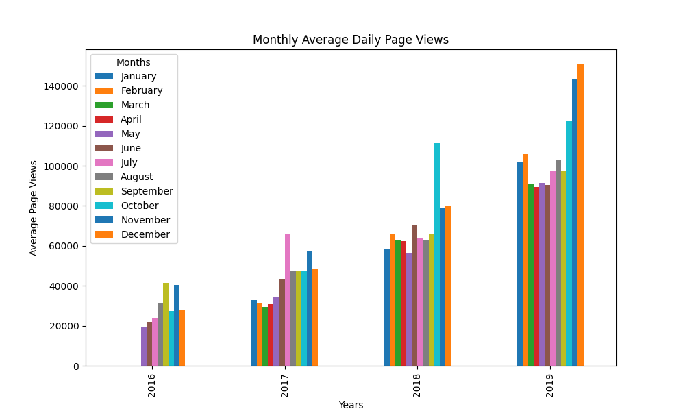
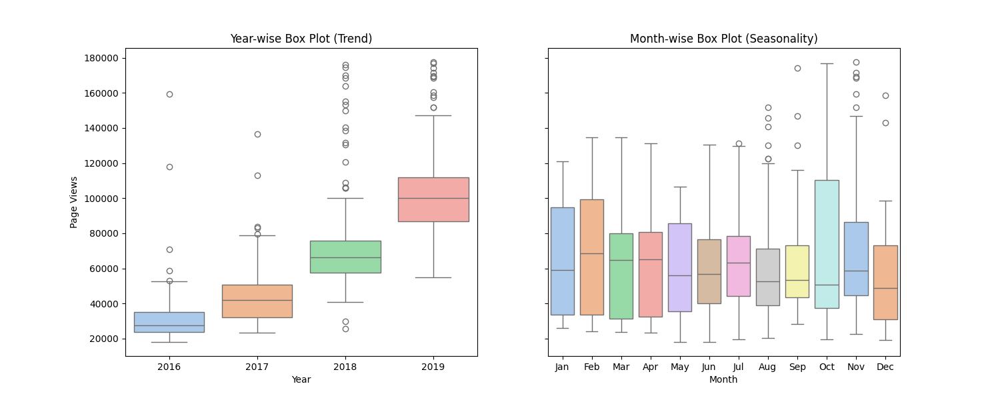

# Page View Time Series Visualizer

This project is a solution to the [Page View Time Series Visualizer challenge](https://www.freecodecamp.org/learn/data-analysis-with-python/data-analysis-with-python-projects/page-view-time-series-visualizer) from freeCodeCamp.

## Description

The goal of this project is to visualize a dataset containing the number of page views each day on the freeCodeCamp.org forum from May 9, 2016, to December 3, 2019. The visualizations provide insights into patterns and trends in the forum's traffic, helping to understand whether the site is growing and identifying the times of the year when it is most popular.

## Example Findings

Three charts have been generated and saved in the root directory:

### Line Plot

  
This line plot illustrates the growth of the site over time, showing an upward trend in the number of daily visitors. The graph effectively captures the overall increase in traffic to the forum, highlighting periods of significant growth.

### Bar Plot

  
This bar plot presents the average daily page views for each month, grouped by year. It provides a clear visualization of the increase in average daily visitors on a monthly basis. The color-coded bars make it easy to compare different months across years, offering insights into seasonal variations and long-term trends.

### Box Plot

  
This set of box plots shows the distribution of daily page views for each year and each month. The plot on the left compares the yearly distributions, while the plot on the right highlights the monthly distributions. It reveals that certain months, such as October, tend to be more popular, possibly due to events like Hacktoberfest.

## Technologies Used

-   **pandas**: For CSV processing and data analysis.
-   **matplotlib** and **seaborn**: For data visualization.
-   **unittest**: For running unit tests.

Ensure that you run `pip install -r requirements.txt` before executing `python main.py`.
